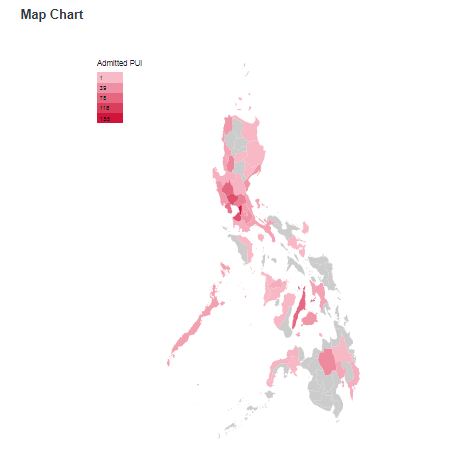
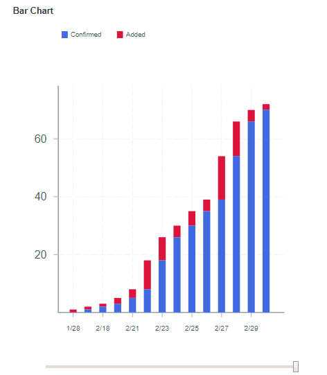
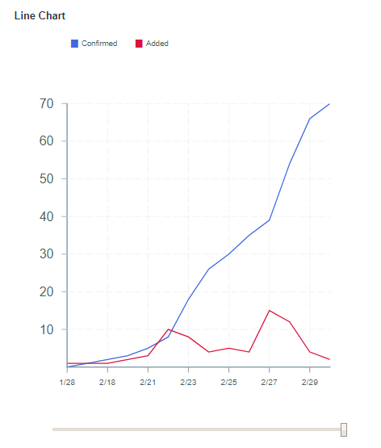

# Data Visualization App using [Next.JS](https://nextjs.org/)

This project is an exercise in my study of ReactJS. 
This is my first attempt to make a data visualization application.

## Description

Please note that **the data are just dummy**. 
It is based from COVID-19 outbreak data.  

* The data are read from csv files using [d3-fetch](https://github.com/d3/d3-fetch) module.

* Bar and Line charts use [victory](https://formidable.com/open-source/victory/docs/) module.

* The map visualization is using [react-simple-maps](https://www.react-simple-maps.io/) module.

* The map and table charts use the same data while the bar and line charts uses also the same data.

Map chart sample

Bar chart sample

Line chart sample

## Available Scripts

In the project directory, you can run:

### `npm install`

To install the required modules.

### `npm run dev`

Runs the app in the development mode. 
Open [http://localhost:3000](http://localhost:3000) to view it in the browser.

The page will reload if you make edits. 
You will also see any lint errors in the console.

